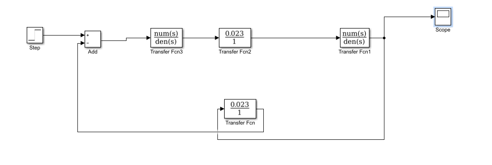
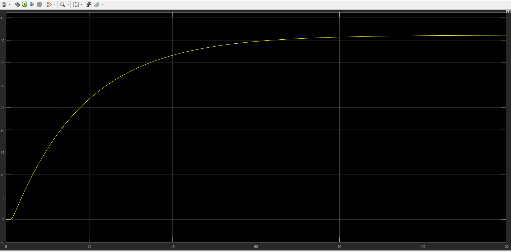
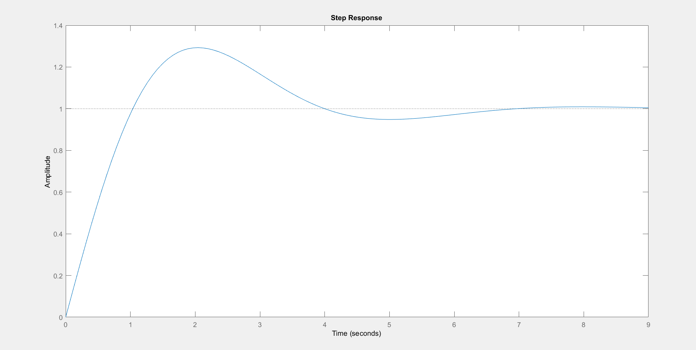
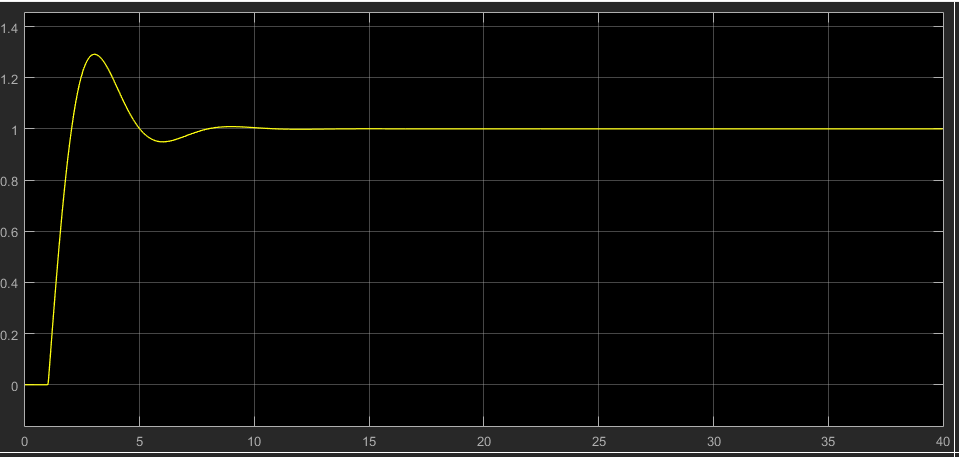
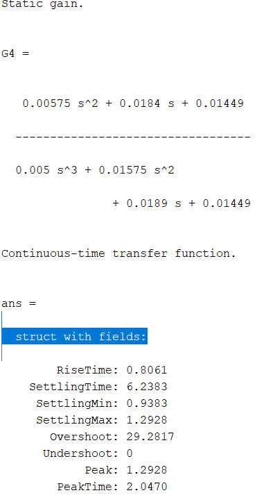

# DC Motor Speed Control using PID Controller (MATLAB/Simulink)

## Overview

This project demonstrates the speed control of a DC motor using a **PID controller** designed with the **Ziegler–Nichols tuning method**. The complete system was modeled in **MATLAB/Simulink**, and the controller was evaluated by comparing the open-loop and closed-loop responses.

---

# Project Workflow

```
DC Motor Model
      ↓
Open Loop Analysis
      ↓
Ziegler-Nichols PID Tuning
      ↓
Closed Loop Simulation
      ↓
Performance Evaluation
```

---

# Simulink Model

The closed-loop speed control model developed in Simulink.

<p align="center">

</p>

---

# System Specifications

| Parameter | Value |
|-----------|-------|
| Motor Torque Constant (Kt) | 0.023 N·m/A |
| Back EMF Constant (Km) | 0.023 V·s/rad |
| Armature Resistance | 1 Ω |
| Armature Inductance | 0.5 H |
| Rotor Inertia | 0.01 kg·m² |
| Viscous Friction | 0.00003 N·m |

---

# DC Motor Transfer Function

\[
G(s)=\frac{0.023}{0.005s^2+0.01s+0.0005}
\]

---

# PID Controller

The PID controller is

\[
C(s)=K_p+\frac{K_i}{s}+K_ds
\]

Using the **Ziegler–Nichols tuning method**, the obtained gains are:

| Parameter | Value |
|-----------|-------|
| Kp | 0.8000 |
| Ki | 0.6380 |
| Kd | 0.2508 |

---

# Open Loop Response

The motor was first analyzed without any controller.

### Performance

| Parameter | Value |
|-----------|-------|
| Rise Time | 38.2458 s |
| Settling Time | 68.6029 s |
| Overshoot | 0 % |
| Steady-State Error | 0.0237 |

### Open Loop Response Plot

<p align="center">

</p>

---

# Ziegler–Nichols Tuning

Selected points from the process reaction curve:

- ta = 8 sec
- ya = 14.52

- tb = 37.7 sec
- yb = 35.09

DC Gain

β = 41.1449

Controller gains obtained:

- **Kp = 0.8000**
- **Ki = 0.6380**
- **Kd = 0.2508**

---

# Closed Loop Response

After applying the PID controller, the response improved significantly.

| Parameter | Value |
|-----------|-------|
| Rise Time | **0.8061 s** |
| Settling Time | **6.2383 s** |
| Peak Time | **2.047 s** |
| Overshoot | **29.28 %** |

### MATLAB Step Response

<p align="center">

</p>

---

# Simulink Scope Output

The response obtained directly from the Simulink Scope.

<p align="center">

</p>

---

# MATLAB StepInfo Output

Performance metrics obtained using the `stepinfo()` function.

<p align="center">

</p>

---

# MATLAB Code

```matlab
n=[0.023];
d=[0.005 0.010 0.0005];

G=tf(n,d);

n1=[0.25 0.80 0.63];
d1=[0 1 0];

G1=tf(n1,d1);

G2=series(G,G1);

G3=tf(1,1);

G4=feedback(G2,G3);

step(G4)
stepinfo(G4)
```

---

# Software Used

- MATLAB
- Simulink
- Control System Toolbox

---

# Results

### Open Loop

- Stable response
- No overshoot
- Large settling time
- Slow rise time

### Closed Loop

- Faster response
- Reduced settling time
- Improved tracking accuracy
- Approximately 29% overshoot due to Ziegler–Nichols tuning

---

# Conclusion

A PID controller was successfully designed using the **Ziegler–Nichols tuning method** to improve the speed response of a DC motor. The controller reduced the rise time from **38.25 s** to **0.81 s** and the settling time from **68.60 s** to **6.24 s**, demonstrating a significant improvement in system dynamics.

Although the controller achieved a much faster response, it introduced approximately **29% overshoot**. In practical industrial applications, additional tuning or optimization techniques such as **Genetic Algorithms (GA), Particle Swarm Optimization (PSO), Fuzzy Logic**, or **auto-tuning** can be used to further reduce overshoot while maintaining fast and stable performance.

---

# Skills Demonstrated

- MATLAB Programming
- Simulink Modeling
- PID Controller Design
- Control System Engineering
- Transfer Function Modeling
- Feedback Control
- Step Response Analysis
- Industrial Process Control

---

# Future Improvements

- PID Auto-Tuning
- Genetic Algorithm Optimization
- Particle Swarm Optimization
- Hardware Implementation using Arduino/STM32
- Disturbance Rejection Analysis

---

# Author

**Ankita Devi**

B.Tech, Electronics & Instrumentation Engineering

National Institute of Technology Silchar
